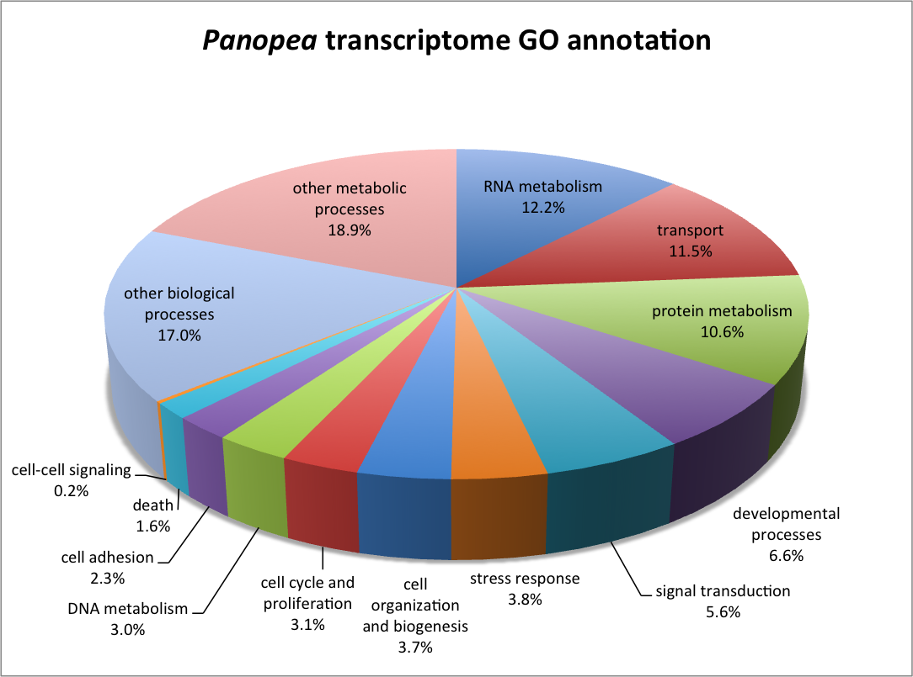
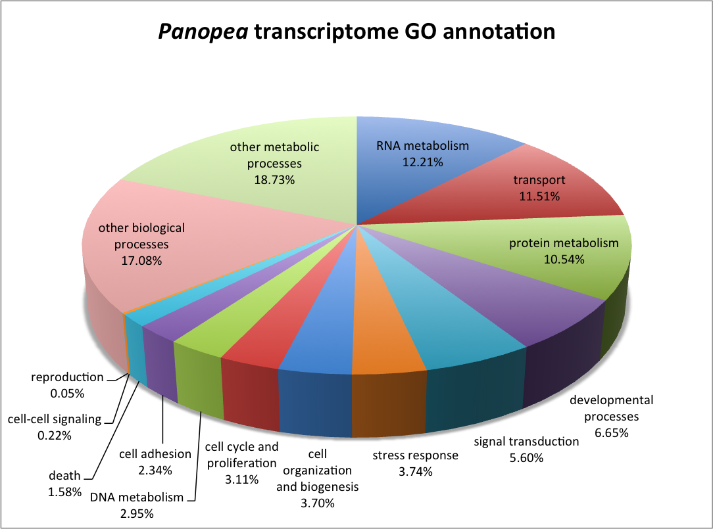

**Annotation**

Of 153,982 sequences that remained after screening for putative non-eukaryote matches, 22,974 (15%) had similarity with proteins in the Swiss-Prot/Uniprot database.  Corrresponding Biological Process Gene Ontology information was obtained for 19, 393 contigs.

Protein similarities were 12.2 % RNA metabolism, 11.5 % transport, 10.6 % protein metabolism and 18.9 % and 17.0 %  with other metabolic and biological processes, respectively (Fig. )

**Figure .** *Panopea generosa* transcriptome gene ontology annotation. 

**Fig.**  *Panopea generosa* transcriptome gene ontology annotation without bacterial annotation but with reproduction annotation (extracted from other other biological processes).

In comparing the Panopea transcriptome with previously described gene sets two contigs were identifed as putatively sex-specific based on work in _Crassostrea gigas_. This incudes contig comp142444, analogous to Forkhead box protein L2 and comp137246 with homology to actin, cytoplasmic A3a. $$$need to confirm not non-euk$$$.  There were 173 contigs that corresponded to gene identified in _Crassostrea gigas_ to be differentially expressed through gametogenesis. 

