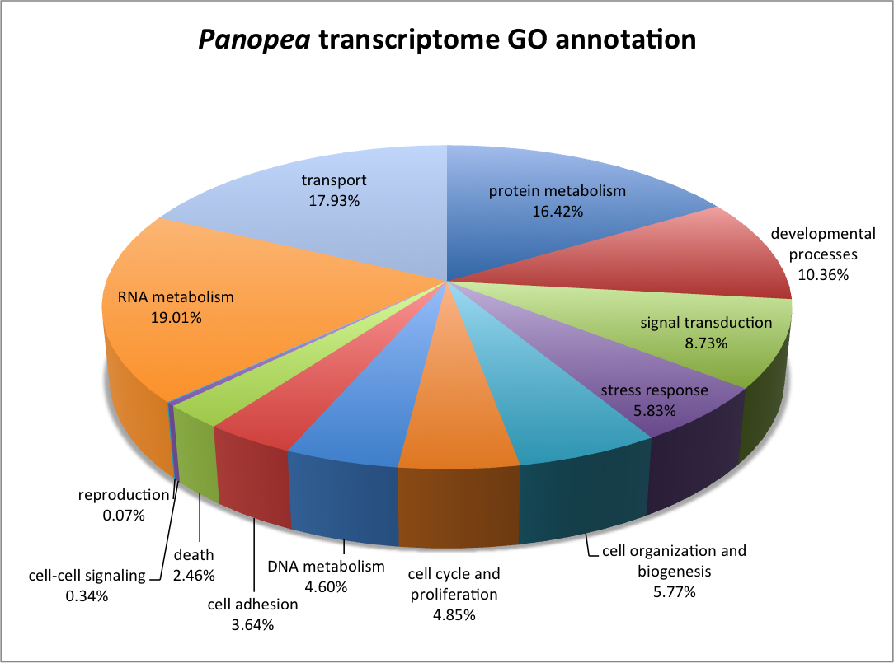

**Annotation**

Of 153,982 sequences that remained after screening for putative non-eukaryote matches, 22,974 (15%) had similarity with proteins in the Swiss-Prot/Uniprot database.  Corrresponding Biological Process Gene Ontology information was obtained for 19, 393 contigs.

**Fig** Distribution of the contigs with Biological process (P), with cellular component (C), and or molecular function (F). Function, contigs, percent (%).

Protein similarities were 19.01 % RNA metabolism, 17.93 % transport, 16.42 % protein metabolism and 10.36 % developmental processes (Fig. 1).

**Fig. 1**  *Panopea generosa* transcriptome gene ontology annotation without bacterial annotation but with reproduction annotation (extracted from other other biological processes). Other biological and metabolic processes were removed. 

**Fig.** The lists of GO terms, were summarized with REVIGO 
[http://http://revigo.irb.hr/](http://http://revigo.irb.hr/) by clustering semantically close GO terms into categories (in different color) of cellular processes.

In comparing the Panopea transcriptome with previously described gene sets two contigs were identifed as putatively sex-specific based on work in _Crassostrea gigas_. This incudes contig comp142444, analogous to Forkhead box protein L2 and comp137246 with homology to actin, cytoplasmic A3a and comp142462_c1_seq1	analogous to the sperm-associated antigen 6 (involved in sperm motility). $$$need to confirm not non-euk$$$.  There were 173 contigs that corresponded to gene identified in _Crassostrea gigas_ to be differentially expressed through gametogenesis. 

Fig. with Dheilly's ( Cluster Des.)

| Panopea_contig      | evalue    | Sigenae_id | Description                                                                                                                            | Cluster | Cluster Des.       | Tissue-enriched expression | High expression        | Adj p value |
|---------------------|-----------|------------|----------------------------------------------------------------------------------------------------------------------------------------|---------|--------------------|----------------------------|------------------------|-------------|
| comp142515_c0_seq2  | 0         | CU683354   | (sp:P18091) Alpha-actinin, sarcomeric OS=Drosophila melanogaster GN=Actn PE=2 SV=2                                                     | 1       | Stage 0            |                            | Adductor muscle        | 2.58E-07    |
| comp137246_c1_seq26 | 3.00E-64  | CU684679   | (sp:P00544) Tyrosine-protein kinase transforming protein Fgr OS=Feline sarcoma virus (strain Gardner-Rasheed) GN=V-FGR PE=3 SV=1       | 1       | Stage 0            |                            | #N/A                   | 3.61E-06    |
| comp116682_c1_seq2  | 1.00E-71  | EW778003   | (sp:P04412) Epidermal growth factor receptor OS=Drosophila melanogaster GN=Egfr PE=1 SV=3                                              | 1       | Stage 0            |                            | Adductor muscle        | 4.05E-06    |
| comp143196_c0_seq1  | 1.00E-136 | CU996492   | (sp:P04040) Catalase OS=Homo sapiens GN=CAT PE=1 SV=3                                                                                  | 1       | Stage 0            |                            | hemocytes              | 4.41E-06    |
| comp124055_c0_seq3  | 6.00E-151 | CU686207   | (sp:P24733) Myosin heavy chain, striated muscle OS=Aequipecten irradians PE=1 SV=1                                                     | 1       | Stage 0            | adductor muscle            | Adductor muscle        | 4.14E-07    |
| comp127090_c0_seq1  | 4.00E-80  | DW713853   | (sp:O08584) Krueppel-like factor 6 OS=Mus musculus GN=Klf6 PE=2 SV=3                                                                   | 1       | Stage 0            |                            | hemocytes              | 4.20E-06    |
| comp141240_c0_seq5  | 5.00E-71  | FP010851   | (sp:A2APV2) Formin-like protein 2 OS=Mus musculus GN=Fmnl2 PE=2 SV=2                                                                   | 1       | Stage 0            |                            | Adductor muscle        | 2.78E-06    |
| comp142437_c1_seq3  | 1.00E-70  | AM864624   | (sp:Q6GYQ0) Ral GTPase-activating protein alpha subunit 1 OS=Homo sapiens GN=RALGAPA1 PE=1 SV=1                                        | 1       | Stage 0            |                            | hemocytes              | 4.43E-06    |
| comp142424_c2_seq1  | 2.00E-95  | CU995837   | (sp:Q14315) Filamin-C OS=Homo sapiens GN=FLNC PE=1 SV=3                                                                                | 2       | Mature Female only |                            | #N/A                   | 5.84E-06    |
| comp133082_c0_seq2  | 2.00E-117 | DV736298   | (sp:Q9PU85) Serine/threonine-protein kinase Pim-3 OS=Coturnix coturnix japonica GN=PIM3 PE=2 SV=1                                      | 2       | Mature Female only |                            | #N/A                   | 6.16E-06    |
| comp143573_c0_seq1  | 0         | EW778397   | (sp:P35224) Catenin beta OS=Urechis caupo PE=2 SV=1                                                                                    | 2       | Mature Female only | female gonad               | #N/A                   | 5.87E-07    |
| comp143196_c0_seq1  | 0         | EF687775   | (sp:Q9PWF7) Catalase OS=Rana rugosa GN=cat PE=2 SV=3                                                                                   | 2       | Mature Female only |                            | #N/A                   | 1.05E-06    |
| comp140491_c1_seq2  | 1.00E-101 | AJ535669   | (sp:Q25410) Putative molluscan insulin-related peptide(s) receptor OS=Lymnaea stagnalis PE=2 SV=1                                      | 2       | Mature Female only |                            | #N/A                   | 2.46E-06    |
| comp142337_c2_seq1  | 3.00E-78  | AM862948   | (sp:Q6P1R4) tRNA-dihydrouridine synthase 1-like OS=Homo sapiens GN=DUS1L PE=1 SV=1                                                     | 2       | Mature Female only |                            | #N/A                   | 2.00E-07    |
| comp144262_c1_seq8  | 2.00E-117 | AM863520   | (sp:Q5R416) Catenin alpha-2 OS=Pongo abelii GN=CTNNA2 PE=2 SV=3                                                                        | 3       | Female stage 2     |                            | #N/A                   | 1.52E-07    |
| comp136546_c0_seq2  | 2.00E-93  | AM868009   | (sp:Q8VBV4) F-box/WD repeat-containing protein 7 OS=Mus musculus GN=Fbxw7 PE=1 SV=1                                                    | 3       | Female stage 2     |                            | #N/A                   | 1.87E-09    |
| comp140336_c1_seq1  | 5.00E-113 | AM867657   | (sp:Q9NXV2) BTB/POZ domain-containing protein KCTD5 OS=Homo sapiens GN=KCTD5 PE=1 SV=1                                                 | 3       | Female stage 2     | female gonad               | #N/A                   | 1.02E-06    |
| comp140253_c0_seq2  | 2.00E-64  | AM854424   | (sp:Q9CY50) Translocon-associated protein subunit alpha OS=Mus musculus GN=Ssr1 PE=1 SV=1                                              | 3       | Female stage 2     |                            | #N/A                   | 1.95E-07    |
| comp138450_c0_seq1  | 3.00E-119 | AM860854   | (sp:Q13415) Origin recognition complex subunit 1 OS=Homo sapiens GN=ORC1L PE=1 SV=2                                                    | 3       | Female stage 2     |                            | #N/A                   | 4.89E-08    |
| comp140963_c2_seq2  | 5.00E-114 | AM857825   | (sp:Q09472) Histone acetyltransferase p300 OS=Homo sapiens GN=EP300 PE=1 SV=2                                                          | 3       | Female stage 2     |                            | #N/A                   | 4.59E-06    |
| comp139776_c0_seq1  | 2.00E-94  | AM858464   | (sp:P49366) Deoxyhypusine synthase OS=Homo sapiens GN=DHPS PE=1 SV=1                                                                   | 3       | Female stage 2     |                            | #N/A                   | 4.38E-06    |
| comp143626_c0_seq1  | 8.00E-76  | CU994233   | (sp:Q9BYJ9) YTH domain family protein 1 OS=Homo sapiens GN=YTHDF1 PE=1 SV=1                                                            | 3       | Female stage 2     |                            | #N/A                   | 5.81E-06    |
| comp138448_c0_seq6  | 6.00E-103 | AM858915   | (sp:O75925) E3 SUMO-protein ligase PIAS1 OS=Homo sapiens GN=PIAS1 PE=1 SV=2                                                            | 3       | Female stage 2     |                            | #N/A                   | 5.77E-06    |
| comp137128_c0_seq1  | 4.00E-109 | AM861629   | (sp:Q60809) CCR4-NOT transcription complex subunit 7 OS=Mus musculus GN=Cnot7 PE=1 SV=1                                                | 3       | Female stage 2     | female gonad               | #N/A                   | 1.11E-08    |
| comp123995_c0_seq1  | 4.00E-96  | AM867308   | (sp:Q5ZKN1) Cell division protein kinase 9 OS=Gallus gallus GN=CDK9 PE=2 SV=1                                                          | 3       | Female stage 2     |                            | #N/A                   | 6.03E-06    |
| comp142670_c2_seq1  | 4.00E-94  | AM861996   | (sp:B2GUV7) Eukaryotic translation initiation factor 5B OS=Rattus norvegicus GN=Eif5b PE=1 SV=1                                        | 3       | Female stage 2     |                            | #N/A                   | 5.91E-06    |
| comp139276_c1_seq1  | 2.00E-180 | AY551096   | (sp:Q4R502) Isocitrate dehydrogenase [NADP], mitochondrial OS=Macaca fascicularis GN=IDH2 PE=2 SV=1                                    | 4       | Female early stage |                            | #N/A                   | 3.42E-08    |
| comp142444_c0_seq2  | 9.00E-63  | AM860211   | (sp:Q6VFT5) Forkhead box protein L2 OS=Oryctolagus cuniculus GN=FOXL2 PE=4 SV=1                                                        | 4       | Female early stage | female gonad               | #N/A                   | 5.03E-07    |
| comp142747_c0_seq1  | 0         | AM860498   | (sp:Q4R6T7) IQ and ubiquitin-like domain-containing protein OS=Macaca fascicularis GN=IQUB PE=2 SV=2                                   | 4       | Female early stage | female gonad               | #N/A                   | 1.49E-09    |
| comp144028_c0_seq3  | 4.00E-98  | CU989217   | (sp:Q499P8) UPF0420 protein C16orf58 homolog OS=Rattus norvegicus PE=2 SV=1                                                            | 4       | Female early stage | female gonad               | #N/A                   | 0           |
| comp138731_c0_seq1  | 3.00E-67  | AM855680   | (sp:Q13889) General transcription factor IIH subunit 3 OS=Homo sapiens GN=GTF2H3 PE=1 SV=2                                             | 4       | Female early stage | female gonad               | #N/A                   | 4.22E-06    |
| comp141098_c0_seq4  | 6.00E-99  | AM862974   | (sp:P56839) Phosphoenolpyruvate phosphomutase OS=Mytilus edulis PE=1 SV=3                                                              | 4       | Female early stage |                            | #N/A                   | 3.78E-07    |
| comp142230_c1_seq2  | 7.00E-74  | AJ563467   | (sp:Q24800) Severin OS=Echinococcus granulosus GN=AG8 PE=2 SV=3                                                                        | 4       | Female early stage |                            | #N/A                   | 3.00E-09    |
| comp123534_c0_seq1  | 5.00E-88  | CU686151   | (sp:Q5RFA3) Alanine--glyoxylate aminotransferase 2, mitochondrial OS=Pongo abelii GN=AGXT2 PE=2 SV=1                                   | 4       | Female early stage |                            | #N/A                   | 4.62E-06    |
| comp143076_c0_seq6  | 2.00E-107 | FP003042   | (sp:P35611) Alpha-adducin OS=Homo sapiens GN=ADD1 PE=1 SV=2                                                                            | 4       | Female early stage | female gonad               | #N/A                   | 1.01E-06    |
| comp141720_c0_seq4  | 7.00E-172 | BQ427315   | (sp:P80467) Alcohol dehydrogenase class-3 OS=Uromastyx hardwickii PE=1 SV=1                                                            | 4       | Female early stage |                            | #N/A                   | 6.19E-06    |
| comp135897_c0_seq2  | 1.00E-91  | AM866953   | (sp:A4IF62) DNA-directed RNA polymerase III subunit RPC1 OS=Bos taurus GN=POLR3A PE=2 SV=1                                             | 4       | Female early stage |                            | #N/A                   | 6.20E-06    |
| comp142890_c1_seq1  | 1.00E-96  | EE677697   | (sp:Q7QC84) Probable methylmalonate-semialdehyde dehydrogenase [acylating], mitochondrial OS=Anopheles gambiae GN=AGAP002499 PE=3 SV=2 | 4       | Female early stage |                            | #N/A                   | 1.29E-06    |
| comp140153_c0_seq2  | 3.00E-80  | AM855747   | (sp:Q5R4R4) Protein LSM14 homolog A OS=Pongo abelii GN=LSM14A PE=2 SV=1                                                                | 4       | Female early stage |                            | #N/A                   | 6.87E-10    |
| comp117801_c0_seq1  | 3.00E-80  | CU987737   | (sp:Q3SZR5) UPF0573 protein C2orf70 homolog OS=Bos taurus PE=2 SV=1                                                                    | 5       | Mature Male only   |                            | Labial palps and gills | 8.71E-07    |
| comp137961_c2_seq3  | 2.00E-159 | AM855102   | (sp:Q9DAK2) Parkin coregulated gene protein homolog OS=Mus musculus GN=Pacrg PE=2 SV=1                                                 | 5       | Mature Male only   |                            | Labial palps and gills | 4.37E-06    |
| comp136738_c2_seq4  | 6.00E-87  | AM868587   | (sp:P14100) Calcium/calmodulin-dependent 3',5'-cyclic nucleotide phosphodiesterase 1A OS=Bos taurus GN=PDE1A PE=1 SV=3                 | 5       | Mature Male only   | male gonad                 | #N/A                   | 8.26E-13    |
| comp142462_c1_seq1  | 2.00E-93  | AM860311   | (sp:Q9JLI7) Sperm-associated antigen 6 OS=Mus musculus GN=Spag6 PE=1 SV=1                                                              | 5       | Mature Male only   |                            | Labial palps and gills | 2.57E-06    |
| comp142462_c0_seq1  | 2.00E-136 | CU684841   | (sp:Q9JLI7) Sperm-associated antigen 6 OS=Mus musculus GN=Spag6 PE=1 SV=1                                                              | 5       | Mature Male only   |                            | Labial palps and gills | 4.60E-06    |
| comp134276_c0_seq1  | 0         | AM855501   | (sp:Q26630) 33 kDa inner dynein arm light chain, axonemal OS=Strongylocentrotus purpuratus PE=1 SV=1                                   | 5       | Mature Male only   |                            | Labial palps and gills | 4.86E-07    |
| comp108487_c0_seq1  | 6.00E-71  | ES789247   | (sp:Q6SP97) Enkurin OS=Mus musculus GN=Enkur PE=1 SV=1                                                                                 | 5       | Mature Male only   |                            | Labial palps and gills | 4.92E-06    |
| comp115977_c0_seq1  | 9.00E-97  | AM866946   | (sp:Q5PPV3) MORN repeat-containing protein 3 OS=Xenopus laevis GN=morn3 PE=2 SV=1                                                      | 5       | Mature Male only   | male gonad                 | Labial palps and gills | 5.39E-06    |
| comp94584_c0_seq1   | 1.00E-63  | ES789955   | (sp:A6NL82) Protein FAM183A OS=Homo sapiens GN=FAM183A PE=2 SV=2                                                                       | 5       | Mature Male only   |                            | Labial palps and gills | 2.43E-07    |
| comp140956_c1_seq6  | 2.00E-97  | AM860858   | (sp:Q3UFY4) Radial spoke head protein 3 homolog A OS=Mus musculus GN=Rsph3a PE=2 SV=1                                                  | 5       | Mature Male only   |                            | Labial palps and gills | 1.80E-08    |
| comp117922_c0_seq1  | 7.00E-67  | AM859590   | (sp:Q9UHP6) Rhabdoid tumor deletion region protein 1 OS=Homo sapiens GN=RTDR1 PE=2 SV=1                                                | 5       | Mature Male only   |                            | Labial palps and gills | 3.00E-07    |
| comp142747_c0_seq1  | 1.00E-173 | CU998233   | (sp:Q4R6T7) IQ and ubiquitin-like domain-containing protein OS=Macaca fascicularis GN=IQUB PE=2 SV=2                                   | 5       | Mature Male only   |                            | Labial palps and gills | 2.88E-06    |
| comp141774_c1_seq1  | 3.00E-154 | AM857935   | (sp:Q66IS6) Bardet-Biedl syndrome 5 protein homolog OS=Xenopus laevis GN=bbs5 PE=2 SV=1                                                | 5       | Mature Male only   | male gonad                 | Labial palps and gills | 8.98E-07    |
| comp135381_c0_seq1  | 2.00E-173 | ES789943   | (sp:Q80Y75) DnaJ homolog subfamily B member 13 OS=Mus musculus GN=Dnajb13 PE=2 SV=1                                                    | 5       | Mature Male only   |                            | Labial palps and gills | 6.11E-07    |
| comp137961_c2_seq3  | 4.00E-155 | CU992930   | (sp:Q9DAK2) Parkin coregulated gene protein homolog OS=Mus musculus GN=Pacrg PE=2 SV=1                                                 | 5       | Mature Male only   |                            | Labial palps and gills | 6.13E-07    |
| comp133634_c0_seq1  | 5.00E-104 | CU682555   | (sp:Q4R7Y8) Uncharacterized protein C14orf45 homolog OS=Macaca fascicularis GN=QtsA-11302 PE=2 SV=2                                    | 5       | Mature Male only   |                            | Labial palps and gills | 9.80E-07    |
| comp28306_c0_seq1   | 3.00E-91  | AM861826   | (sp:Q4V7T8) Ropporin-1-like protein OS=Xenopus laevis GN=ropn1l PE=2 SV=1                                                              | 5       | Mature Male only   |                            | Labial palps and gills | 2.30E-08    |
| comp144411_c0_seq3  | 5.00E-89  | AM859337   | (sp:P0C5J2) B9 domain-containing protein 1 OS=Rattus norvegicus GN=B9d1 PE=2 SV=1                                                      | 5       | Mature Male only   |                            | #N/A                   | 6.23E-07    |
| comp127584_c0_seq1  | 7.00E-151 | AM853323   | (sp:O15990) Arginine kinase OS=Liolophura japonica PE=2 SV=1                                                                           | 5       | Mature Male only   | male gonad                 | #N/A                   | 5.35E-06    |
| comp143382_c0_seq4  | 1.00E-107 | AM866114   | (sp:Q8IWZ6) Bardet-Biedl syndrome 7 protein OS=Homo sapiens GN=BBS7 PE=1 SV=2                                                          | 5       | Mature Male only   |                            | Labial palps and gills | 2.46E-06    |
| comp125539_c0_seq1  | 5.00E-120 | DV736572   | (sp:P56597) Nucleoside diphosphate kinase homolog 5 OS=Homo sapiens GN=NME5 PE=1 SV=1                                                  | 5       | Mature Male only   |                            | Labial palps and gills | 2.23E-09    |
| comp141715_c0_seq3  | 3.00E-67  | AM854208   | (sp:Q28G94) Dynein light chain 1, axonemal OS=Xenopus tropicalis GN=dnal1 PE=2 SV=1                                                    | 5       | Mature Male only   |                            | Labial palps and gills | 1.90E-06    |
| comp130790_c0_seq2  | 7.00E-130 | AM862765   | (sp:Q9Z1K5) Protein ariadne-1 homolog OS=Mus musculus GN=Arih1 PE=2 SV=3                                                               | 5       | Mature Male only   | male gonad                 | #N/A                   | 3.95E-10    |
| comp130334_c1_seq1  | 2.00E-87  | AM866620   | (sp:Q8CCB4) Vacuolar protein sorting-associated protein 53 homolog OS=Mus musculus GN=Vps53 PE=2 SV=1                                  | 5       | Mature Male only   | male gonad                 | Visceral ganglion      | 6.55E-08    |
| comp143876_c0_seq7  | 7.00E-86  | BQ426960   | (sp:A1A5Q4) UPF0704 protein C6orf165 homolog OS=Rattus norvegicus PE=2 SV=1                                                            | 5       | Mature Male only   |                            | Labial palps and gills | 8.13E-08    |
| comp138578_c1_seq1  | 1.00E-105 | CU993384   | (sp:Q5JVL4) EF-hand domain-containing protein 1 OS=Homo sapiens GN=EFHC1 PE=1 SV=1                                                     | 5       | Mature Male only   |                            | Labial palps and gills | 1.92E-06    |
| comp138578_c0_seq1  | 3.00E-96  | ES789239   | (sp:Q9D9T8) EF-hand domain-containing protein 1 OS=Mus musculus GN=Efhc1 PE=1 SV=1                                                     | 5       | Mature Male only   |                            | Labial palps and gills | 1.56E-06    |
| comp141641_c0_seq2  | 6.00E-78  | CU685202   | (sp:Q5T655) Coiled-coil domain-containing protein 147 OS=Homo sapiens GN=CCDC147 PE=2 SV=1                                             | 5       | Mature Male only   |                            | Labial palps and gills | 2.50E-07    |
| comp137723_c0_seq1  | 1.00E-91  | AM856886   | (sp:Q0VFN8) Uncharacterized protein C9orf117 homolog OS=Xenopus tropicalis PE=2 SV=1                                                   | 5       | Mature Male only   |                            | Labial palps and gills | 1.65E-07    |
| comp142619_c0_seq8  | 3.00E-81  | CU994336   | (sp:Q9BZ19) Ankyrin repeat domain-containing protein 60 OS=Homo sapiens GN=ANKRD60 PE=2 SV=3                                           | 5       | Mature Male only   |                            | Labial palps and gills | 1.84E-07    |
| comp50630_c0_seq1   | 1.00E-141 | CU983935   | (sp:Q567I9) Cytochrome b5 domain-containing protein 1 OS=Danio rerio GN=cyb5d1 PE=2 SV=1                                               | 5       | Mature Male only   |                            | Labial palps and gills | 5.40E-08    |
| comp59400_c0_seq1   | 2.00E-66  | AM864903   | (sp:Q96M60) Uncharacterized protein C15orf33 OS=Homo sapiens GN=C15orf33 PE=2 SV=2                                                     | 5       | Mature Male only   | male gonad                 | Labial palps and gills | 5.54E-06    |
| comp144123_c0_seq3  | 5.00E-77  | EE677599   | (sp:O43805) Sjoegren syndrome nuclear autoantigen 1 OS=Homo sapiens GN=SSNA1 PE=1 SV=2                                                 | 5       | Mature Male only   |                            | #N/A                   | 5.91E-06    |
| comp111825_c0_seq1  | 5.00E-100 | CU987413   | (sp:Q28FE4) MORN repeat-containing protein 5 OS=Xenopus tropicalis GN=morn5 PE=2 SV=1                                                  | 5       | Mature Male only   | male gonad                 | Labial palps and gills | 4.03E-09    |
| comp143022_c0_seq8  | 1.00E-94  | AM864669   | (sp:Q6NZQ0) Coiled-coil domain-containing protein C16orf93 homolog OS=Mus musculus GN=Gm166 PE=2 SV=2                                  | 5       | Mature Male only   |                            | Labial palps and gills | 2.05E-07    |
| comp131335_c0_seq1  | 1.00E-128 | AM857430   | (sp:Q0VC09) RIB43A-like with coiled-coils protein 1 OS=Bos taurus GN=RIBC1 PE=2 SV=1                                                   | 5       | Mature Male only   |                            | Labial palps and gills | 5.50E-06    |
| comp142462_c0_seq1  | 9.00E-138 | CU990254   | (sp:Q9JLI7) Sperm-associated antigen 6 OS=Mus musculus GN=Spag6 PE=1 SV=1                                                              | 5       | Mature Male only   |                            | Labial palps and gills | 1.46E-06    |
| comp140104_c0_seq1  | 4.00E-108 | AM858229   | (sp:Q4R642) T-complex-associated testis-expressed protein 1 OS=Macaca fascicularis GN=TCTE1 PE=2 SV=1                                  | 5       | Mature Male only   |                            | Labial palps and gills | 1.66E-06    |
| comp141939_c0_seq2  | 0         | AM857837   | (sp:A7MBF6) Uncharacterized protein C1orf228 homolog OS=Bos taurus PE=2 SV=1                                                           | 5       | Mature Male only   |                            | Labial palps and gills | 4.65E-07    |
| comp140126_c0_seq2  | 1.00E-139 | AM869290   | (sp:P12370) cAMP-dependent protein kinase catalytic subunit OS=Drosophila melanogaster GN=Pka-C1 PE=1 SV=3                             | 6       | Male 1-3 increase  |                            | #N/A                   | 1.01E-07    |
| comp122083_c0_seq1  | 1.00E-76  | AM854428   | (sp:P62870) Transcription elongation factor B polypeptide 2 OS=Rattus norvegicus GN=Tceb2 PE=1 SV=1                                    | 6       | Male 1-3 increase  |                            | #N/A                   | 3.35E-09    |
| comp123774_c0_seq1  | 0         | AJ431728   | (sp:P41383) Tubulin alpha-2/alpha-4 chain OS=Patella vulgata GN=TUB2 PE=2 SV=1                                                         | 6       | Male 1-3 increase  | male gonad                 | #N/A                   | 4.67E-07    |
| comp131711_c0_seq2  | 4.00E-127 | DW713885   | (sp:Q95NR9) Calmodulin OS=Metridium senile PE=1 SV=3                                                                                   | 6       | Male 1-3 increase  |                            | #N/A                   | 4.10E-09    |
| comp130892_c0_seq2  | 3.00E-65  | FP008556   | (sp:Q3SXZ7) Probable tubulin polyglutamylase TTLL9 OS=Homo sapiens GN=TTLL9 PE=2 SV=3                                                  | 6       | Male 1-3 increase  |                            | Labial palps and gills | 9.98E-07    |
| comp137246_c1_seq24 | 7.00E-117 | CF369133   | (sp:Q25010) Actin, cytoplasmic A3a OS=Helicoverpa armigera GN=actA3a PE=2 SV=1                                                         | 6       | Male 1-3 increase  |                            | #N/A                   | 7.24E-09    |
| comp140005_c4_seq4  | 1.00E-90  | AM858990   | (sp:O02485) Uncharacterized protein ZK1073.1 OS=Caenorhabditis elegans GN=ZK1073.1 PE=2 SV=1                                           | 6       | Male 1-3 increase  |                            | #N/A                   | 6.25E-07    |
| comp142657_c2_seq1  | 2.00E-71  | AM859447   | (sp:Q9UPY8) Microtubule-associated protein RP/EB family member 3 OS=Homo sapiens GN=MAPRE3 PE=1 SV=1                                   | 6       | Male 1-3 increase  |                            | #N/A                   | 5.16E-06    |
| comp143518_c1_seq3  | 4.00E-82  | AM863560   | (sp:Q7ZVC2) Clusterin-associated protein 1 homolog OS=Danio rerio GN=cluap1 PE=2 SV=2                                                  | 7       | Males and Females  |                            | #N/A                   | 9.85E-07    |
| comp143850_c0_seq23 | 2.00E-131 | CU995306   | (sp:P48380) Transcription factor RFX3 OS=Homo sapiens GN=RFX3 PE=2 SV=2                                                                | 7       | Males and Females  |                            | #N/A                   | 1.63E-07    |
| comp141725_c0_seq1  | 2.00E-69  | CU682645   | (sp:P67963) Casein kinase I isoform alpha OS=Xenopus laevis GN=csnk1a1 PE=2 SV=1                                                       | 7       | Males and Females  |                            | #N/A                   | 1.89E-06    |
| comp141064_c0_seq10 | 8.00E-69  | AM865392   | (sp:O14578) Citron Rho-interacting kinase OS=Homo sapiens GN=CIT PE=1 SV=2                                                             | 7       | Males and Females  |                            | #N/A                   | 2.35E-07    |
| comp139568_c4_seq3  | 8.00E-107 | AM857512   | (sp:P54279) Mismatch repair endonuclease PMS2 OS=Mus musculus GN=Pms2 PE=1 SV=1                                                        | 7       | Males and Females  |                            | #N/A                   | 6.15E-06    |
| comp123636_c0_seq1  | 8.00E-61  | CX069346   | (sp:Q6QLW4) Cytochrome c OS=Pectinaria gouldii PE=3 SV=1                                                                               | 7       | Males and Females  |                            | #N/A                   | 4.97E-08    |
| comp134267_c0_seq5  | 3.00E-122 | AM864416   | (sp:Q92630) Dual specificity tyrosine-phosphorylation-regulated kinase 2 OS=Homo sapiens GN=DYRK2 PE=1 SV=3                            | 7       | Males and Females  |                            | #N/A                   | 1.14E-08    |
| comp110047_c0_seq2  | 1.00E-90  | FP003003   | (sp:Q922R1) UPF0183 protein C16orf70 homolog OS=Mus musculus PE=2 SV=1                                                                 | 7       | Males and Females  |                            | #N/A                   | 1.49E-06    |
| comp137292_c0_seq2  | 1.00E-107 | AM861293   | (sp:Q96GG9) DCN1-like protein 1 OS=Homo sapiens GN=DCUN1D1 PE=1 SV=1                                                                   | 7       | Males and Females  |                            | #N/A                   | 5.91E-06    |
| comp133345_c1_seq2  | 7.00E-64  | AM859011   | (sp:Q5VVX9) Ubiquitin-conjugating enzyme E2 U OS=Homo sapiens GN=UBE2U PE=1 SV=1                                                       | 7       | Males and Females  |                            | #N/A                   | 1.67E-07    |
| comp139567_c0_seq6  | 4.00E-155 | AM868574   | (sp:P51892) DNA ligase 1 OS=Xenopus laevis GN=lig1 PE=2 SV=1                                                                           | 7       | Males and Females  |                            | #N/A                   | 5.92E-09    |
| comp132821_c0_seq1  | 4.00E-86  | AM856856   | (sp:Q8CFP6) DnaJ homolog subfamily C member 27 OS=Mus musculus GN=Dnajc27 PE=2 SV=1                                                    | 7       | Males and Females  |                            | #N/A                   | 2.40E-06    |
| comp144394_c0_seq3  | 4.00E-66  | ES789731   | (sp:Q13099) Intraflagellar transport protein 88 homolog OS=Homo sapiens GN=IFT88 PE=1 SV=2                                             | 7       | Males and Females  |                            | #N/A                   | 6.02E-08    |
| comp142811_c0_seq2  | 1.00E-109 | BQ427333   | (sp:Q9BPU9) B9 domain-containing protein 2 OS=Homo sapiens GN=B9D2 PE=2 SV=2                                                           | 7       | Males and Females  |                            | #N/A                   | 4.10E-06    |
| comp144511_c0_seq9  | 2.00E-116 | AM237648   | (sp:Q801E2) Actin-binding protein anillin OS=Xenopus laevis GN=anln PE=1 SV=1                                                          | 7       | Males and Females  |                            | #N/A                   | 1.26E-09    |
| comp129985_c0_seq1  | 2.00E-103 | AM861092   | (sp:O75800) Zinc finger MYND domain-containing protein 10 OS=Homo sapiens GN=ZMYND10 PE=1 SV=2                                         | 7       | Males and Females  |                            | #N/A                   | 1.68E-07    |
| comp143973_c1_seq2  | 5.00E-109 | AM859992   | (sp:Q9DE46) DNA polymerase alpha catalytic subunit OS=Xenopus laevis GN=pola1 PE=2 SV=1                                                | 7       | Males and Females  |                            | #N/A                   | 2.13E-07    |
| comp140707_c3_seq1  | 3.00E-122 | AM862862   | (sp:Q7YR39) Putative pre-mRNA-splicing factor ATP-dependent RNA helicase DHX16 OS=Pan troglodytes GN=DHX16 PE=3 SV=1                   | 7       | Males and Females  |                            | #N/A                   | 6.21E-06    |
| comp112669_c1_seq1  | 7.00E-63  | CU995701   | (sp:Q8TAM2) Tetratricopeptide repeat protein 8 OS=Homo sapiens GN=TTC8 PE=1 SV=1                                                       | 7       | Males and Females  |                            | #N/A                   | 5.96E-06    |
| comp138574_c1_seq1  | 9.00E-116 | AM864177   | (sp:Q68FX0) Isocitrate dehydrogenase [NAD] subunit beta, mitochondrial OS=Rattus norvegicus GN=Idh3B PE=2 SV=1                         | 8       | Males and Females  | male gonad                 | #N/A                   | 2.95E-06    |
| comp136486_c0_seq2  | 2.00E-80  | AM863722   | (sp:Q3MHN0) Proteasome subunit beta type-6 OS=Bos taurus GN=PSMB6 PE=1 SV=1                                                            | 8       | Males and Females  |                            | #N/A                   | 1.10E-06    |
| comp130260_c0_seq1  | 5.00E-96  | CU991591   | (sp:P70040) Flap endonuclease 1-A OS=Xenopus laevis GN=fen1-A PE=1 SV=1                                                                | 8       | Males and Females  |                            | #N/A                   | 3.54E-08    |
| comp143568_c0_seq2  | 9.00E-163 | CU991150   | (sp:P49739) Maternal DNA replication licensing factor mcm3 OS=Xenopus laevis GN=mmcm3 PE=1 SV=2                                        | 8       | Males and Females  |                            | #N/A                   | 1.17E-07    |
| comp131711_c0_seq3  | 4.00E-148 | CD526833   | (sp:Q8STF0) Calmodulin OS=Strongylocentrotus intermedius PE=2 SV=3                                                                     | 8       | Males and Females  |                            | #N/A                   | 3.85E-07    |
| comp122280_c0_seq1  | 2.00E-71  | AM864414   | (sp:O73672) Proteasome subunit alpha type-2 OS=Carassius auratus GN=psma2 PE=2 SV=3                                                    | 8       | Males and Females  |                            | #N/A                   | 5.88E-07    |
| comp142222_c0_seq2  | 1.00E-88  | AM859623   | (sp:Q99J62) Replication factor C subunit 4 OS=Mus musculus GN=Rfc4 PE=1 SV=1                                                           | 8       | Males and Females  |                            | #N/A                   | 1.75E-07    |
| comp134749_c0_seq1  | 7.00E-151 | BQ426386   | (sp:Q9PTW9) Proteasome subunit alpha type-7 OS=Carassius auratus GN=psma7 PE=2 SV=1                                                    | 8       | Males and Females  |                            | #N/A                   | 8.88E-08    |
| comp142431_c0_seq2  | 7.00E-124 | CU986637   | (sp:P62489) DNA-directed RNA polymerase II subunit RPB7 OS=Rattus norvegicus GN=Polr2g PE=2 SV=1                                       | 8       | Males and Females  |                            | #N/A                   | 2.38E-08    |
| comp142594_c0_seq1  | 1.00E-114 | AM861427   | (sp:P20664) DNA primase small subunit OS=Mus musculus GN=Prim1 PE=1 SV=1                                                               | 8       | Males and Females  |                            | #N/A                   | 1.02E-06    |
| comp123874_c0_seq2  | 2.00E-69  | FP005816   | (sp:Q9CY94) DNA replication complex GINS protein PSF3 OS=Mus musculus GN=Gins3 PE=2 SV=1                                               | 8       | Males and Females  |                            | #N/A                   | 1.19E-06    |
| comp143216_c1_seq8  | 2.00E-67  | AM864974   | (sp:Q556Y9) Mitotic spindle assembly checkpoint protein MAD2A OS=Dictyostelium discoideum GN=mad2l1-1 PE=3 SV=1                        | 8       | Males and Females  |                            | #N/A                   | 1.56E-08    |
| comp138574_c1_seq1  | 8.00E-88  | CU989074   | (sp:Q68FX0) Isocitrate dehydrogenase [NAD] subunit beta, mitochondrial OS=Rattus norvegicus GN=Idh3B PE=2 SV=1                         | 8       | Males and Females  | male gonad                 | #N/A                   | 2.16E-06    |
| comp139946_c0_seq6  | 5.00E-113 | AM861838   | (sp:P35250) Replication factor C subunit 2 OS=Homo sapiens GN=RFC2 PE=1 SV=3                                                           | 8       | Males and Females  |                            | #N/A                   | 4.32E-07    |
| comp124268_c0_seq1  | 7.00E-120 | AM864705   | (sp:P70195) Proteasome subunit beta type-7 OS=Mus musculus GN=Psmb7 PE=1 SV=1                                                          | 8       | Males and Females  |                            | #N/A                   | 1.83E-07    |
| comp50528_c0_seq1   | 1.00E-64  | AM858935   | (sp:Q0MQI7) NADH dehydrogenase [ubiquinone] flavoprotein 2, mitochondrial OS=Pongo pygmaeus GN=NDUFV2 PE=2 SV=1                        | 8       | Males and Females  |                            | #N/A                   | 7.97E-07    |
| comp143707_c0_seq1  | 8.00E-80  | AM856942   | (sp:Q7T0M6) Histone chaperone asf1-B OS=Xenopus laevis GN=asf1-B PE=2 SV=1                                                             | 8       | Males and Females  |                            | #N/A                   | 2.98E-07    |
| comp144423_c1_seq2  | 3.00E-97  | AM862425   | (sp:P50532) Structural maintenance of chromosomes protein 4 OS=Xenopus laevis GN=smc4 PE=1 SV=1                                        | 8       | Males and Females  |                            | #N/A                   | 1.74E-07    |
| comp140479_c0_seq1  | 9.00E-110 | AM864373   | (sp:Q91917) DNA repair protein RAD51 homolog B OS=Xenopus laevis GN=rad51-B PE=2 SV=1                                                  | 8       | Males and Females  |                            | #N/A                   | 2.58E-08    |
| comp91488_c0_seq2   | 3.00E-73  | AM864330   | (sp:O73817) Proteasome subunit beta type-3 OS=Oncorhynchus mykiss GN=psmb3 PE=2 SV=1                                                   | 8       | Males and Females  |                            | #N/A                   | 6.14E-06    |
| comp132461_c0_seq1  | 7.00E-153 | AM858476   | (sp:Q8R323) Replication factor C subunit 3 OS=Mus musculus GN=Rfc3 PE=2 SV=1                                                           | 8       | Males and Females  |                            | #N/A                   | 1.66E-06    |
| comp136877_c1_seq2  | 4.00E-123 | AM858831   | (sp:P40937) Replication factor C subunit 5 OS=Homo sapiens GN=RFC5 PE=1 SV=1                                                           | 8       | Males and Females  |                            | #N/A                   | 1.87E-10    |
| comp120086_c0_seq1  | 2.00E-140 | CU992983   | (sp:Q9CPY6) Uncharacterized protein C17orf39 homolog OS=Mus musculus PE=2 SV=1                                                         | 8       | Males and Females  |                            | #N/A                   | 6.11E-07    |
| comp140093_c0_seq3  | 2.00E-74  | AM858776   | (sp:P07735) Glycerol-3-phosphate dehydrogenase [NAD+], cytoplasmic OS=Drosophila virilis GN=Gpdh PE=1 SV=3                             | 8       | Males and Females  | male gonad                 | #N/A                   | 6.44E-07    |
| comp28280_c0_seq1   | 2.00E-135 | AM868500   | (sp:P62335) 26S protease regulatory subunit S10B OS=Spermophilus tridecemlineatus GN=PSMC6 PE=2 SV=1                                   | 8       | Males and Females  |                            | #N/A                   | 4.27E-06    |
| comp133131_c0_seq2  | 2.00E-100 | BQ426921   | (sp:P83941) Transcription elongation factor B polypeptide 1 OS=Rattus norvegicus GN=Tceb1 PE=1 SV=1                                    | 8       | Males and Females  |                            | #N/A                   | 4.34E-09    |
| comp48421_c0_seq1   | 1.00E-102 | BQ427163   | (sp:Q5BJ65) Histone H2A.V OS=Xenopus tropicalis GN=h2afv PE=2 SV=3                                                                     | 8       | Males and Females  |                            | #N/A                   | 6.84E-12    |
| comp140617_c0_seq2  | 0         | AM858396   | (sp:Q6P2U9) COP9 signalosome complex subunit 3 OS=Danio rerio GN=cops3 PE=2 SV=1                                                       | 8       | Males and Females  |                            | #N/A                   | 5.18E-06    |
| comp130760_c0_seq1  | 6.00E-111 | BQ426947   | (sp:O42149) Protein mago nashi homolog OS=Xenopus laevis GN=magoh PE=2 SV=1                                                            | 8       | Males and Females  |                            | #N/A                   | 1.82E-06    |
| comp137927_c0_seq1  | 4.00E-76  | AM869337   | (sp:Q29RZ2) Peptidylprolyl isomerase domain and WD repeat-containing protein 1 OS=Bos taurus GN=PPWD1 PE=2 SV=1                        | 8       | Males and Females  | male gonad                 | #N/A                   | 2.81E-08    |
| comp108941_c0_seq1  | 5.00E-109 | BQ426475   | (sp:Q9CZ15) DNA replication complex GINS protein PSF1 OS=Mus musculus GN=Gins1 PE=2 SV=1                                               | 8       | Males and Females  |                            | #N/A                   | 3.69E-10    |
| comp136624_c0_seq1  | 0         | AM859534   | (sp:P46470) 26S protease regulatory subunit 8 OS=Xenopus laevis GN=psmc5 PE=2 SV=2                                                     | 8       | Males and Females  |                            | #N/A                   | 3.56E-06    |
| comp110084_c0_seq1  | 2.00E-91  | AM866236   | (sp:Q9Y248) DNA replication complex GINS protein PSF2 OS=Homo sapiens GN=GINS2 PE=1 SV=1                                               | 8       | Males and Females  |                            | #N/A                   | 1.82E-11    |
| comp143167_c1_seq1  | 1.00E-134 | BQ426799   | (sp:P28075) Proteasome subunit beta type-5 OS=Rattus norvegicus GN=Psmb5 PE=1 SV=3                                                     | 8       | Males and Females  |                            | #N/A                   | 3.03E-08    |
| comp122176_c0_seq1  | 3.00E-67  | AM855687   | (sp:P61959) Small ubiquitin-related modifier 2 OS=Rattus norvegicus GN=Sumo2 PE=1 SV=1                                                 | 9       | Males and Females  |                            | #N/A                   | 6.91E-10    |
| comp135745_c0_seq1  | 1.00E-63  | AM862973   | (sp:Q9QYE0) Zinc finger protein PLAG1 OS=Mus musculus GN=Plag1 PE=2 SV=1                                                               | 9       | Males and Females  |                            | #N/A                   | 1.37E-07    |
| comp143111_c1_seq1  | 2.00E-99  | AM859520   | (sp:P30664) DNA replication licensing factor mcm4-B OS=Xenopus laevis GN=mcm4-B PE=1 SV=3                                              | 9       | Males and Females  |                            | #N/A                   | 8.83E-08    |
| comp137929_c0_seq1  | 9.00E-92  | AM854229   | (sp:O44437) Small nuclear ribonucleoprotein Sm D3 OS=Drosophila melanogaster GN=SmD3 PE=1 SV=1                                         | 9       | Males and Females  |                            | #N/A                   | 2.56E-06    |
| comp139145_c0_seq2  | 2.00E-90  | AM866997   | (sp:Q8BMB3) Eukaryotic translation initiation factor 4E type 2 OS=Mus musculus GN=Eif4e2 PE=1 SV=1                                     | 9       | Males and Females  |                            | #N/A                   | 5.86E-06    |
| comp134037_c0_seq2  | 2.00E-79  | AM860755   | (sp:P60899) DNA-directed RNA polymerase II subunit RPB9 OS=Sus scrofa GN=POLR2I PE=3 SV=1                                              | 9       | Males and Females  |                            | #N/A                   | 6.18E-06    |
| comp139393_c0_seq2  | 0         | FP089861   | (sp:Q24572) Probable histone-binding protein Caf1 OS=Drosophila melanogaster GN=Caf1 PE=1 SV=1                                         | 9       | Males and Females  |                            | #N/A                   | 9.77E-07    |
| comp140689_c0_seq2  | 7.00E-119 | CU990820   | (sp:Q561P5) DNA replication licensing factor mcm5 OS=Xenopus tropicalis GN=mcm5 PE=2 SV=1                                              | 9       | Males and Females  |                            | #N/A                   | 1.65E-12    |
| comp144251_c0_seq2  | 2.00E-107 | AM237674   | (sp:Q7ZXB1) DNA replication licensing factor mcm7-B OS=Xenopus laevis GN=mcm7-B PE=2 SV=1                                              | 9       | Males and Females  |                            | #N/A                   | 4.98E-11    |
| comp139165_c0_seq2  | 5.00E-83  | AM237649   | (sp:P07201) Ribonucleoside-diphosphate reductase small chain OS=Spisula solidissima PE=2 SV=2                                          | 9       | Males and Females  |                            | #N/A                   | 2.75E-13    |
| comp143445_c0_seq12 | 8.00E-111 | AM863306   | (sp:P83917) Chromobox protein homolog 1 OS=Mus musculus GN=Cbx1 PE=1 SV=1                                                              | 9       | Males and Females  |                            | #N/A                   | 2.27E-07    |
| comp144116_c0_seq6  | 3.00E-97  | AM861509   | (sp:Q6DIH3) DNA replication licensing factor mcm2 OS=Xenopus tropicalis GN=mcm2 PE=2 SV=1                                              | 9       | Males and Females  |                            | #N/A                   | 1.30E-07    |
| comp116084_c0_seq1  | 6.00E-82  | AM860925   | (sp:Q28165) Polyadenylate-binding protein 2 OS=Bos taurus GN=PABPN1 PE=1 SV=3                                                          | 9       | Males and Females  |                            | #N/A                   | 2.92E-06    |
| comp141596_c0_seq6  | 1.00E-155 | AM858460   | (sp:P28021) Casein kinase II subunit beta OS=Xenopus laevis GN=csnk2b PE=1 SV=1                                                        | 9       | Males and Females  |                            | #N/A                   | 6.13E-06    |
| comp143362_c0_seq2  | 9.00E-65  | AM859331   | (sp:Q5R7Q4) Replication protein A 70 kDa DNA-binding subunit OS=Pongo abelii GN=RPA1 PE=2 SV=1                                         | 9       | Males and Females  |                            | #N/A                   | 6.16E-06    |
| comp144251_c0_seq2  | 2.00E-99  | AM862562   | (sp:Q6NX31) DNA replication licensing factor mcm7 OS=Xenopus tropicalis GN=mcm7 PE=2 SV=1                                              | 9       | Males and Females  |                            | #N/A                   | 0           |
| comp139393_c0_seq2  | 0         | CB617555   | (sp:Q09028) Histone-binding protein RBBP4 OS=Homo sapiens GN=RBBP4 PE=1 SV=3                                                           | 9       | Males and Females  |                            | #N/A                   | 1.95E-07    |
| comp144629_c0_seq1  | 3.00E-98  | CU686554   | (sp:Q7ZUY3) Histone H2A.x OS=Danio rerio GN=h2afx PE=2 SV=3                                                                            | 9       | Males and Females  |                            | #N/A                   | 1.31E-08    |
| comp144423_c1_seq2  | 8.00E-108 | AM859381   | (sp:Q9FJL0) Structural maintenance of chromosomes protein 4 OS=Arabidopsis thaliana GN=SMC4 PE=2 SV=1                                  | 9       | Males and Females  |                            | #N/A                   | 8.77E-08    |
| comp122176_c0_seq1  | 3.00E-67  | CU992682   | (sp:P61959) Small ubiquitin-related modifier 2 OS=Rattus norvegicus GN=Sumo2 PE=1 SV=1                                                 | 9       | Males and Females  |                            | #N/A                   | 2.65E-08    |
| comp141044_c0_seq2  | 1.00E-63  | CU685382   | (sp:Q9V3J8) Protein will die slowly OS=Drosophila melanogaster GN=wds PE=2 SV=1                                                        | 9       | Males and Females  |                            | #N/A                   | 3.72E-06    |
| comp141803_c0_seq1  | 1.00E-91  | DV736591   | (sp:Q5R637) T-complex protein 1 subunit delta OS=Pongo abelii GN=CCT4 PE=2 SV=3                                                        | 9       | Males and Females  |                            | #N/A                   | 5.93E-06    |
| comp122176_c0_seq1  | 5.00E-65  | FP011152   | (sp:P61959) Small ubiquitin-related modifier 2 OS=Rattus norvegicus GN=Sumo2 PE=1 SV=1                                                 | 9       | Males and Females  | female gonad               | #N/A                   | 5.81E-06    |
| comp141861_c1_seq1  | 5.00E-152 | AM857246   | (sp:P60892) Ribose-phosphate pyrophosphokinase 1 OS=Rattus norvegicus GN=Prps1 PE=1 SV=2                                               | 9       | Males and Females  |                            | #N/A                   | 7.94E-09    |
| comp141289_c0_seq6  | 3.00E-62  | CU998781   | (sp:P62311) U6 snRNA-associated Sm-like protein LSm3 OS=Mus musculus GN=Lsm3 PE=2 SV=2                                                 | 9       | Males and Females  |                            | #N/A                   | 2.55E-08    |
| comp134387_c0_seq1  | 1.00E-97  | CU996024   | (sp:Q08013) Translocon-associated protein subunit gamma OS=Rattus norvegicus GN=Ssr3 PE=1 SV=2                                         | 9       | Males and Females  |                            | #N/A                   | 7.87E-08    |
| comp129247_c0_seq2  | 9.00E-110 | AM869433   | (sp:P28370) Probable global transcription activator SNF2L1 OS=Homo sapiens GN=SMARCA1 PE=1 SV=2                                        | 9       | Males and Females  | female gonad               | #N/A                   | 6.26E-07    |
| comp125113_c0_seq1  | 7.00E-62  | AM856760   | (sp:Q642A5) DNA polymerase epsilon subunit 3 OS=Rattus norvegicus GN=Pole3 PE=2 SV=1                                                   | 9       | Males and Females  |                            | #N/A                   | 1.23E-11    |
| comp140352_c2_seq9  | 2.00E-140 | FP000294   | (sp:Q1JPX3) Phenylalanyl-tRNA synthetase alpha chain OS=Danio rerio GN=farsa PE=2 SV=2                                                 | 9       | Males and Females  |                            | #N/A                   | 6.21E-06    |
| comp134387_c0_seq1  | 1.00E-96  | CX069186   | (sp:Q08013) Translocon-associated protein subunit gamma OS=Rattus norvegicus GN=Ssr3 PE=1 SV=2                                         | 9       | Males and Females  |                            | #N/A                   | 8.42E-08    |
| comp132248_c0_seq1  | 2.00E-177 | AM856889   | (sp:Q9Z2U1) Proteasome subunit alpha type-5 OS=Mus musculus GN=Psma5 PE=1 SV=1                                                         | 9       | Males and Females  |                            | #N/A                   | 1.05E-06    |
| comp137842_c0_seq1  | 4.00E-128 | FP000131   | (sp:Q8BTM8) Filamin-A OS=Mus musculus GN=Flna PE=1 SV=4                                                                                | 10      | Males and Females  |                            | Adductor muscle        | 5.16E-06    |
| comp144461_c0_seq7  | 3.00E-87  | CU999937   | (sp:Q9Y490) Talin-1 OS=Homo sapiens GN=TLN1 PE=1 SV=3                                                                                  | 10      | Males and Females  |                            | Adductor muscle        | 1.74E-06    |

